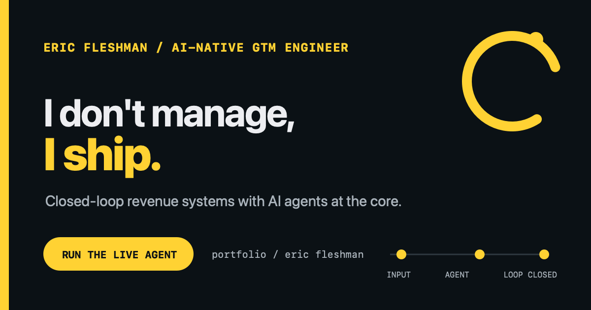

# ericfleshman.com

A fast, dependency-free GTM engineering portfolio with a live company-to-systems agent. Enter a company name and the site returns a first-pass GTM systems hypothesis grounded in current public context.

**Live:** [ericfleshman.com](https://ericfleshman.com)

## How the agent works

1. The browser sends only the company name to a Vercel serverless function.
2. Perplexity Sonar researches current public context about the company, buyer, and motion.
3. Claude Haiku 4.5 applies Eric's GTM playbook to that evidence through OpenRouter.
4. The server scans the note for private inputs and public-style violations before returning it.
5. The browser renders the hypothesis. Nothing is written to a CRM and no outreach is sent.

Every successful request follows this live path. There is no curated response cache.

## Guardrails

The agent is intentionally narrow. The boundary is part of the product.

- **Server-side keys:** Provider credentials never reach the browser.
- **Durable global cap:** Upstash Redis limits daily generations. Missing Redis fails closed.
- **Private-input blocklist:** Sensitive company inputs are SHA-256 hashed in a protected environment variable, never stored in public source.
- **Output gate:** The response is scanned before rendering so blocked inputs cannot leak into public output.
- **Kill switch:** `AGENT_ENABLED` disables the endpoint without a code change.
- **Fail loud:** Research or synthesis failures return a human email fallback instead of a canned answer.

The site does not perform person lookup, contact enrichment, visitor identification, input storage by Eric, CRM writes, or outbound messaging. Perplexity and OpenRouter receive the submitted company name to perform the live request.

## Stack

- Static HTML, CSS, and vanilla JavaScript
- Vercel serverless function
- Perplexity Sonar for public-web research
- Claude Haiku 4.5 through OpenRouter for synthesis
- Upstash Redis REST for the daily cap
- Vercel Web Analytics for pageviews

No framework, package install, or build step is required.

## Project structure

- `index.html`, `styles.css`, `app.js`: public site
- `api/agent.js`: research, synthesis, and guardrails
- `vercel.json`: function timeout and security headers
- `fonts/`, `images/`, `favicon.svg`, `og-sunflower.png`: visual assets
- `Eric-Fleshman-Resume.pdf`: view-first public resume

## Run and deploy

1. Copy `.env.example` values into Vercel Project Settings.
2. Add a free Upstash Redis database through the Vercel Marketplace.
3. Set `BLOCKED_INPUT_HASHES` to comma-separated SHA-256 hashes for any private company inputs.
4. Run `npx vercel` for a preview.
5. Test a permitted company and confirm the API returns `mode: perplexity-claude`.
6. Run `npx vercel --prod` after the preview passes.

Required environment variables:

- `OPENROUTER_API_KEY`
- `PERPLEXITY_API_KEY`
- `AGENT_ENABLED=true`
- `BLOCKED_INPUT_HASHES`
- `KV_REST_API_URL` and `KV_REST_API_TOKEN`, or the matching Upstash variable names

Optional variables:

- `AGENT_MODEL`, default `anthropic/claude-haiku-4.5`
- `AGENT_DAILY_CAP`, default `20`

## Honest provenance

Eric specified the wedge, case-study evidence, privacy boundary, system behavior, guardrails, and design direction. AI agents compressed the initial scaffold, implementation, and review cycle. Eric decided what the system could claim, what it must refuse to do, and what deserved to ship.

The result reflects the same operating model the site advocates: agents build, humans gate, and the loop is not trusted until it closes in production.
