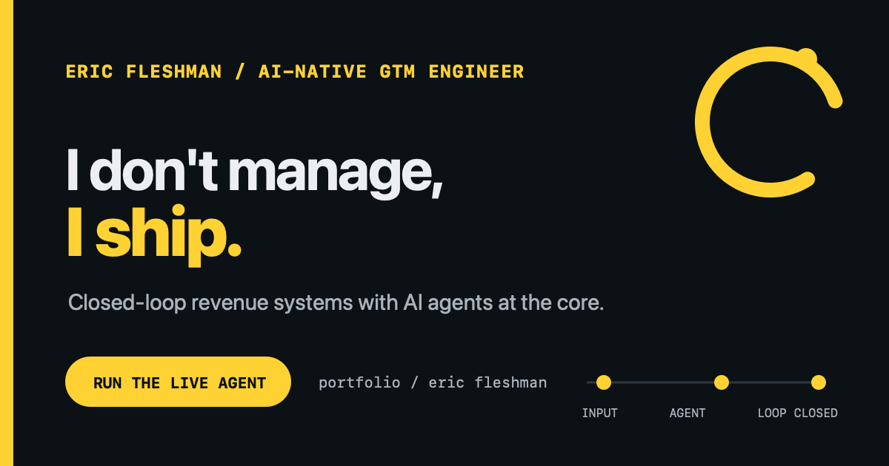

# ericfleshman.com

A fast, dependency-free GTM engineering portfolio.

**Live:** [ericfleshman.com](https://ericfleshman.com)

## Stack

- Static HTML, CSS, and vanilla JavaScript
- Vercel Web Analytics for pageviews

No framework, package install, or build step is required.

## Project structure

- `index.html`, `styles.css`, `app.js`: public site
- `vercel.json`: redirects and security headers
- `fonts/`, `images/`, `favicon.svg`, `og-sunflower.png`: visual assets
- `Eric-Fleshman-Resume.pdf`: view-first public resume

## Run and deploy

1. Run `npx vercel` for a preview.
2. Run `npx vercel --prod` after the preview passes.

## Honest provenance

Eric specified the wedge, case-study evidence, privacy boundary, system behavior, guardrails, and design direction. AI agents compressed the initial scaffold, implementation, and review cycle. Eric decided what the system could claim, what it must refuse to do, and what deserved to ship.

The result reflects the same operating model the site advocates: agents build, humans gate, and the loop is not trusted until it closes in production.
